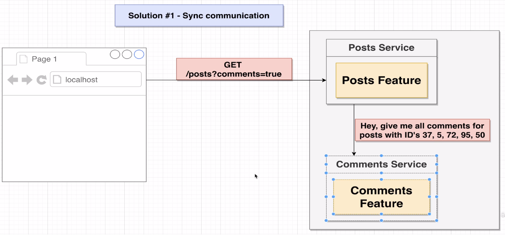
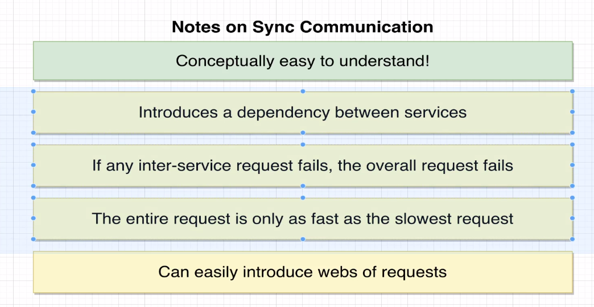
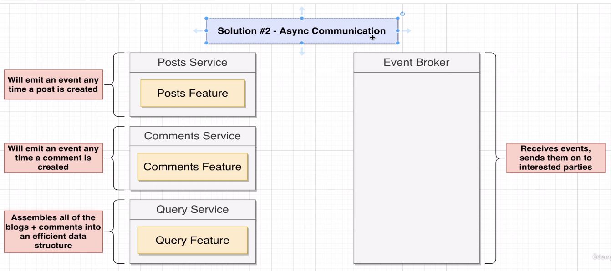
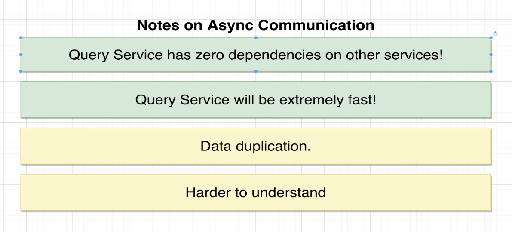
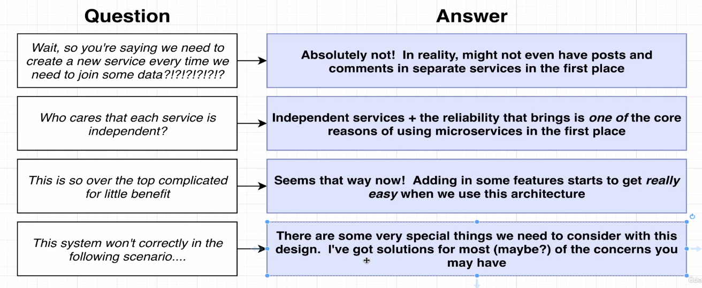

# Microservices Project: Post and Comments Application

## Overview
In this project, the goal is to build an application featuring post and comments functionality, following a microservices architecture. The architecture emphasizes both synchronous (Sync) and asynchronous (Async) communication between services.

### Synchronous Communication

#### Request-Response Model


Synchronous communication involves direct request-response interactions between services. This approach is suitable for scenarios where real-time responses are crucial.

#### Notification Model


An alternative to the request-response model is the notification model, where a service notifies others about changes or events without expecting an immediate response.

### Asynchronous Communication

#### Query Service and Event Bus
To facilitate asynchronous communication, a dedicated service called the "Query Service" is introduced. This service acts as an intermediary for events, and an Event Bus is utilized to keep all interested services in sync.



#### Non-Synchronous Communication
In situations where immediate responses are not required, asynchronous communication provides a more scalable and flexible solution.



## Questions and Considerations on Asynchronous Communication



## Adding a New Feature: Comment Moderation Service

### Objective
Create a new service to handle comment moderation, tagging comments as "Pending," "Approved," or "Rejected" based on privacy policy compliance.

#### Question is how to make it in sync with comment service so that when it goes down we will get all stuff's simple

* we can make it as like way, whenever comment Emit an Event, Moderation service will also subscribe that Event from Event Bus, and start processing till then the Created Comment stored in DB with the help of Query Service so that comment is ready to display.

#### Handling if any case Query Service get Crashed then how we track that previosu which all tasks that Query Service missed to store.

* If any case Query Service will goes down and again whenever it will live again then how we get previous missed Event to store. 
* To do this we have to maintain the Events in Event Bus, so that whenever Query Service and other any service goes down and get live again. 
* Services are able to get all previous Events/ or unprocessed Events. To processed.
   * <strong>We will do this handling like this, whenever service goes live it will fetch all unprocessed data to processed.</strong>

   ```bash
   app.listen(4002, async () => {
   console.log("Listening on 4002");
      try {
         const res = await axios.get("http://localhost:4005/events");

         for (let event of res.data) {
            console.log("Processing event:", event.type);

            handleEvent(event.type, event.data);
         }
      } catch (error) {
         console.log(error.message);
      }
   });
   

## Getting Started

1. Clone the repository:
   ```bash
   git clone https://github.com/mohd-rafey-khan/micro-services.git
2. Project are in blog directory
   ```bash
   cd blog
3. Install dependencies for each service:    
   ```bash
   cd posts
   npm install
   # Repeat for other services
4. To Run all Services Run
   ```bash
   npm start
   # Repeat for other services